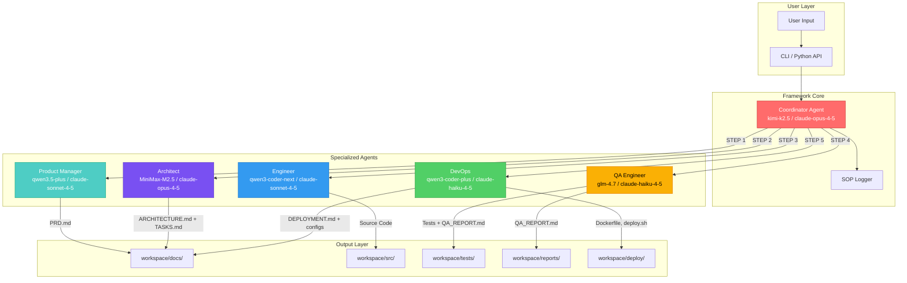
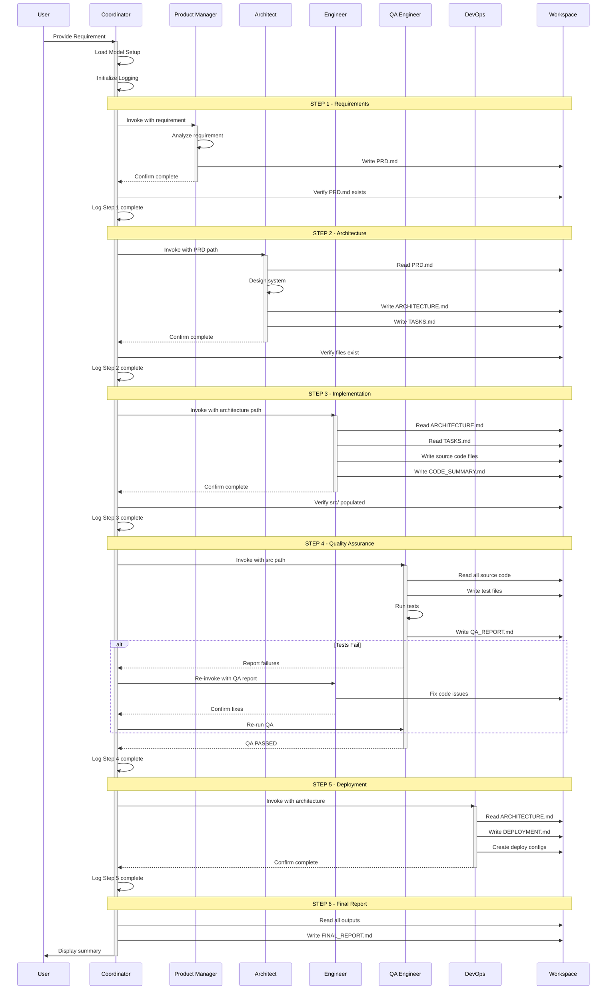
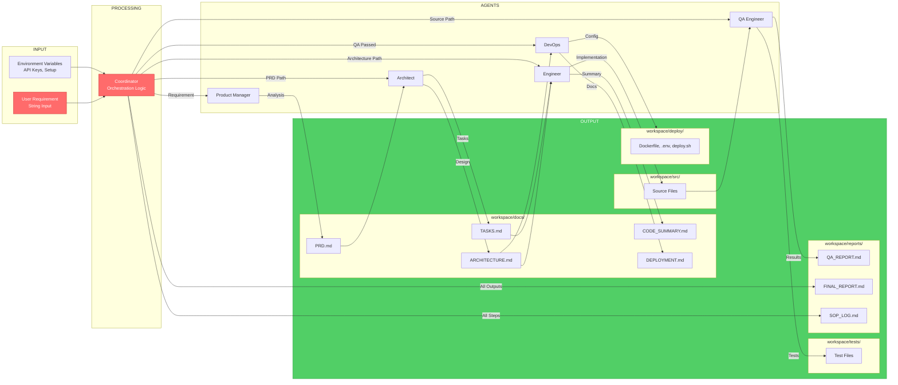
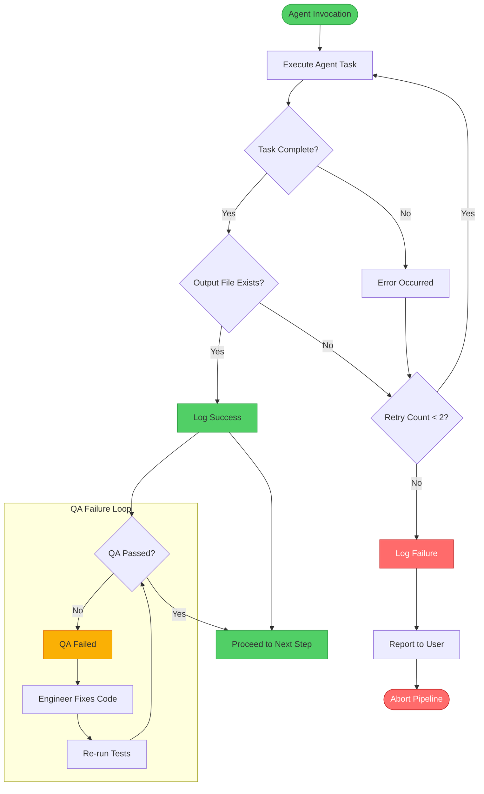
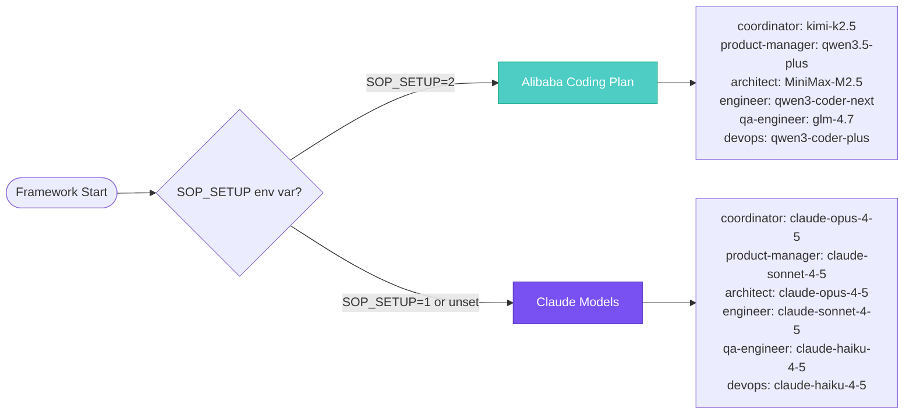

# SOP(Team) Framework

A generic, reusable multi-agent software development framework powered by Claude Code subagents. Inspired by MetaGPT, this framework orchestrates a complete software team: Product Manager -> Architect -> Engineer -> QA -> DevOps.

---

## Table of Contents

- [Architecture Overview](#architecture-overview)
- [How It Works](#how-it-works)
- [SOP Pipeline Diagram](#sop-pipeline-diagram)
- [Agent Communication Flow](#agent-communication-flow)
- [Data Flow Diagram](#data-flow-diagram)
- [Error Handling Flow](#error-handling-flow)
- [Features](#features)
- [Quick Start](#quick-start)
- [Agents](#agents)
- [Output Files](#output-files)
- [Usage Examples](#usage-examples)
- [Requirements](#requirements)

---

## Architecture Overview

The SOP(Team) Framework implements a hierarchical multi-agent architecture where a central **Coordinator** orchestrates specialized agents in a strict sequential pipeline.



---

## How It Works

The framework follows a **Standard Operating Procedure (SOP)** - a strict, sequential pipeline where each agent must complete its deliverables before the next agent can begin.

### Key Principles

1. **Sequential Execution**: Agents run in strict order - no parallel execution
2. **Gate Verification**: Each step confirms file existence before proceeding
3. **Single Responsibility**: Each agent has one specific domain
4. **Automatic Retry**: Failed QA triggers automatic re-implementation
5. **Complete Logging**: Every action logged to SOP_LOG.md

---

## SOP Pipeline Diagram

```mermaid
flowchart TD
    START([User Provides Requirement]) --> INIT[Initialize Framework]
    INIT --> SETUP{Model Setup}
    SETUP -->|SOP_SETUP=2| ALI[Alibaba Models]
    SETUP -->|SOP_SETUP=1| CLA[Claude Models]

    ALI --> COORD1[Coordinator Starts Pipeline]
    CLA --> COORD1

    COORD1 --> STEP1[STEP 1: Requirements]

    subgraph PHASE1 [Phase 1: Product Management]
        STEP1 --> PM1[Product Manager Analyzes]
        PM1 --> PM2[Write PRD.md]
        PM2 --> PM3{PRD.md exists?}
        PM3 -->|No| PM2
        PM3 -->|Yes| PM4[Log Step Complete]
    end

    PM4 --> STEP2[STEP 2: Architecture]

    subgraph PHASE2 [Phase 2: System Design]
        STEP2 --> ARCH1[Architect Reads PRD]
        ARCH1 --> ARCH2[Choose Tech Stack]
        ARCH2 --> ARCH3[Write ARCHITECTURE.md]
        ARCH3 --> ARCH4[Write TASKS.md]
        ARCH4 --> ARCH5{Files exist?}
        ARCH5 -->|No| ARCH3
        ARCH5 -->|Yes| ARCH6[Log Step Complete]
    end

    ARCH6 --> STEP3[STEP 3: Implementation]

    subgraph PHASE3 [Phase 3: Code Generation]
        STEP3 --> ENG1[Engineer Reads Architecture]
        ENG1 --> ENG2[Implement All Code]
        ENG2 --> ENG3[Write CODE_SUMMARY.md]
        ENG3 --> ENG4{src/ populated?}
        ENG4 -->|No| ENG2
        ENG4 -->|Yes| ENG5[Log Step Complete]
    end

    ENG5 --> STEP4[STEP 4: Quality Assurance]

    subgraph PHASE4 [Phase 4: Testing]
        STEP4 --> QA1[QA Reads Code]
        QA1 --> QA2[Write Unit Tests]
        QA2 --> QA3[Write Integration Tests]
        QA3 --> QA4[Run All Tests]
        QA4 --> QA5[Write QA_REPORT.md]
        QA5 --> QA6{All Tests Pass?}
        QA6 -->|No| QA7[Send Report to Engineer]
        QA7 --> ENG2
        QA6 -->|Yes| QA8[Log QA PASSED]
    end

    QA8 --> STEP5[STEP 5: Deployment]

    subgraph PHASE5 [Phase 5: DevOps]
        STEP5 --> DEV1[DevOps Reads Architecture]
        DEV1 --> DEV2[Write DEPLOYMENT.md]
        DEV2 --> DEV3[Create Deploy Configs]
        DEV3 --> DEV4{Files exist?}
        DEV4 -->|No| DEV2
        DEV4 -->|Yes| DEV5[Log Step Complete]
    end

    DEV5 --> STEP6[STEP 6: Final Report]
    STEP6 --> FINAL[Write FINAL_REPORT.md]
    FINAL --> DONE([Pipeline Complete])

    style START fill:#51cf66,stroke:#2f9e44
    style DONE fill:#51cf66,stroke:#2f9e44
    style QA6 fill:#fab005,stroke:#e67700
```



---

## Agent Communication Flow



---

## Data Flow Diagram



---

## Error Handling Flow



---

## Features

| Feature | Description |
|---------|-------------|
| **Fully Generic** | No assumptions about technology, industry, or project type |
| **Sequential Pipeline** | Strict SOP ensures consistent, high-quality output |
| **Multi-Agent** | 6 specialized agents for each phase of development |
| **Self-Contained** | All outputs written to the workspace directory |
| **Retry Logic** | Failed QA triggers automatic re-implementation |
| **Dual Model Support** | Works with Alibaba Coding Plan or Claude models |
| **Complete Logging** | Full audit trail in SOP_LOG.md |
| **CLI + API** | Use via command line or Python import |

---

## Quick Start

### Option 1 - Python SDK
```bash
pip install sop-team-framework
sop-team "Build a REST API for user authentication"
```

### Option 2 - From Source
```bash
git clone https://github.com/shalinda-j/SOP-Team.git
cd SOP-Team
pip install -r requirements.txt
python agent.py "Build a REST API for user authentication"
```

### Option 3 - Shell Script
```bash
chmod +x run.sh
./run.sh "Create a data pipeline for ETL processing"
```

### Option 4 - Direct Claude CLI
```bash
claude
> Use the coordinator agent at .claude/agents/coordinator.md
> Then provide your requirement
```

---

## Agents

### Agent Roles & Responsibilities

| Agent | Role | Input | Output | Model (Alibaba) | Model (Claude) |
|-------|------|-------|--------|-----------------|----------------|
| **Coordinator** | Orchestrates pipeline | User requirement | Final summary | kimi-k2.5 | claude-opus-4-5 |
| **Product Manager** | Requirements analysis | Requirement string | PRD.md | qwen3.5-plus | claude-sonnet-4-5 |
| **Architect** | System design | PRD.md | ARCHITECTURE.md, TASKS.md | MiniMax-M2.5 | claude-opus-4-5 |
| **Engineer** | Code implementation | ARCHITECTURE.md, TASKS.md | src/*, CODE_SUMMARY.md | qwen3-coder-next | claude-sonnet-4-5 |
| **QA Engineer** | Testing | src/* | tests/*, QA_REPORT.md | glm-4.7 | claude-haiku-4-5 |
| **DevOps** | Deployment | ARCHITECTURE.md, CODE_SUMMARY.md | DEPLOYMENT.md, deploy/* | qwen3-coder-plus | claude-haiku-4-5 |

### Model Selection



### Switching Setups

**Alibaba Models (Default - Setup 2):**
```bash
export ALIBABA_API_KEY=your-alibaba-coding-plan-key
python agent.py "your requirement"
```

**Claude Models (Setup 1):**
```bash
export SOP_SETUP=1
export ANTHROPIC_API_KEY=your-anthropic-key
python agent.py "your requirement"
```

---

## Output Files

All outputs are written to the `workspace/` directory:

```
workspace/
├── docs/
│   ├── PRD.md              # Product Requirements Document
│   │   └── Executive Summary, User Stories, Functional Requirements
│   ├── ARCHITECTURE.md     # System Architecture
│   │   └── Tech Stack, Component Diagram, Database Schema, API Design
│   ├── TASKS.md            # Implementation Tasks
│   │   └── Numbered tasks with files to create and complexity
│   ├── CODE_SUMMARY.md     # Code Documentation
│   │   └── Files created, decisions, dependencies, env vars
│   └── DEPLOYMENT.md       # Deployment Guide
│       └── Infrastructure, steps, commands, rollback
├── src/                    # All source code
│   └── [Language-specific structure based on architecture]
├── tests/                  # All test files
│   ├── unit/               # Unit tests
│   └── integration/        # Integration tests
├── reports/
│   ├── QA_REPORT.md        # Test Results
│   │   └── Tests written, passed/failed, coverage, issues
│   ├── FINAL_REPORT.md     # Complete Summary
│   │   └── Full project summary with all deliverables
│   └── SOP_LOG.md          # Execution Log
│       └── Timestamped log of all pipeline steps
└── deploy/                 # Deployment configs
    ├── .env.example        # Environment variables template
    ├── deploy.sh           # Deployment script
    ├── Dockerfile          # Container definition
    └── docker-compose.yml  # Multi-service orchestration
```

---

## The SOP (Standard Operating Procedure)

The framework follows a strict 6-step procedure:

| Step | Agent | Action | Output |
|------|-------|--------|--------|
| 1 | Product Manager | Analyze requirement, write PRD | PRD.md |
| 2 | Architect | Design system, create task list | ARCHITECTURE.md, TASKS.md |
| 3 | Engineer | Implement all code | src/*, CODE_SUMMARY.md |
| 4 | QA Engineer | Write and run tests | tests/*, QA_REPORT.md |
| 5 | DevOps | Create deployment configs | DEPLOYMENT.md, deploy/* |
| 6 | Coordinator | Summarize everything | FINAL_REPORT.md |

---

## Directory Structure

```
sop-team-framework/
├── .claude/
│   └── agents/
│       ├── coordinator.md      # Master orchestrator
│       ├── product-manager.md  # PRD writer
│       ├── architect.md        # System designer
│       ├── engineer.md         # Code implementer
│       ├── qa-engineer.md      # Test writer
│       └── devops.md           # Deployment planner
├── src/
│   └── sop_team_framework/     # Python package
│       ├── __init__.py
│       ├── agent.py            # Main module
│       └── agents/             # Agent definitions
├── workspace/                  # Output directory
│   ├── docs/
│   ├── src/
│   ├── tests/
│   ├── reports/
│   └── deploy/
├── .github/
│   └── workflows/
│       └── publish.yml         # PyPI publishing
├── agent.py                    # CLI entry point
├── pyproject.toml              # Package config
├── requirements.txt            # Dependencies
├── LICENSE                     # MIT License
├── CHANGELOG.md                # Version history
└── README.md                   # This file
```

---

## Usage Examples

```bash
# Web application
python agent.py "Build a blog platform with user authentication and comments"

# API development
python agent.py "Create a GraphQL API for an e-commerce product catalog"

# Data pipeline
python agent.py "Build an ETL pipeline that processes CSV files into a PostgreSQL database"

# Mobile backend
python agent.py "Design and implement a backend API for a fitness tracking mobile app"

# Automation
python agent.py "Create an automated invoice generation and email system"

# Microservices
python agent.py "Design a microservices architecture for a food delivery platform"

# CLI Tool
python agent.py "Build a CLI tool for managing Docker containers"
```

---

## Requirements

| Requirement | Version |
|-------------|---------|
| Python | 3.8+ |
| claude-agent-sdk | >=0.1.0 |
| python-dotenv | >=1.0.0 |

Dependencies are auto-installed if missing.

---

## Environment Variables

```bash
# For Alibaba Models (default)
ALIBABA_API_KEY=your-alibaba-coding-plan-key

# For Claude Models
SOP_SETUP=1
ANTHROPIC_API_KEY=your-anthropic-key
```

Create a `.env` file in the project root:

```env
# .env
ALIBABA_API_KEY=your-key-here
# SOP_SETUP=1  # Uncomment to use Claude models
```

---

## License

MIT License - Free to use, modify, and distribute.

---

## Contributing

1. Fork the repository
2. Create a feature branch: `git checkout -b feature/my-feature`
3. Commit changes: `git commit -am 'Add my feature'`
4. Push to branch: `git push origin feature/my-feature`
5. Submit a Pull Request

---

## Links

- **GitHub:** https://github.com/shalinda-j/SOP-Team
- **PyPI:** https://pypi.org/project/sop-team-framework/
- **Issues:** https://github.com/shalinda-j/SOP-Team/issues